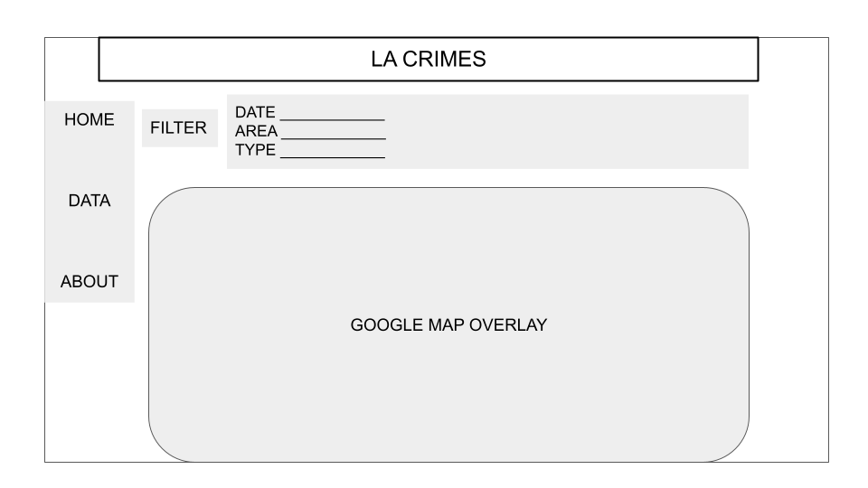

# LA Crime
## Summary
Our project extracts [LA crime data](https://www.kaggle.com/datasets/susant4learning/crime-in-los-angeles-data-from-2020) and hosts it on GCP. It supports basic database related queries and potentially a google map overlay that provides visual representation of the crime. Users will be able to look up crime information, filtered or ordered by dates, areas or types. A visual map that highlights areas with high crime rate is generated from our dataset.
## Functionality
Our web application will display crime in areas of Los Angeles sorted from the areas with the most to least crime that has happened. Users will be able to choose different ways to filter or sort the data. If possible, our web application will display a map of Los Angeles, with each area color coded according to the amount of crime that has happened since 2020.
## Usefulness
This website will be useful for any person interested in living in the Los Angeles area or someone that is currently living there that may want to know about their city’s crime rate. A person that is thinking about moving to LA can view the crime data and see which area has the least crime to help them make a decision on where to move in.
## Database
Our database contains crime information in LA since 2020. Information for each crime are in 3 main categories: Date/Time, Area/District, and Crime Description.
## Realness
Our [dataset](https://www.kaggle.com/datasets/susant4learning/crime-in-los-angeles-data-from-2020-to-present) is the Crime Statistics Data from the city of Los Angeles, California dating back to 2020. It contains different data points identifying different crimes such as date occurred, date reported, time of crime, area, area code, district number, crime description, etc.

This dataset is obtained from Kaggle and created using crime data from the Los Angeles Police Department. It is also one of the recommended datasets from the 411 staff.
## UI Mockup

## Work Distribution
-   Host the website on GCP and set up connections : Everyone
	-   Host a blank website on GCP : Mukut
	-   Front end and page structure : Hammad
-   Set up SQL queries : David and Anna
-   Filter helper functions : Everyone(TBD)
-   Google map overlay : Everyone(TBD)
